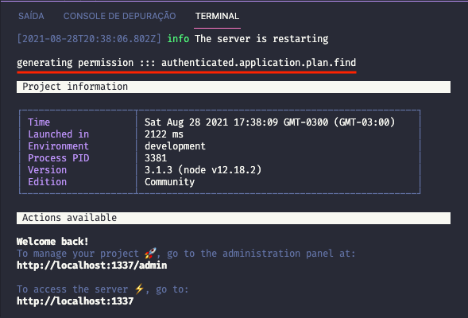
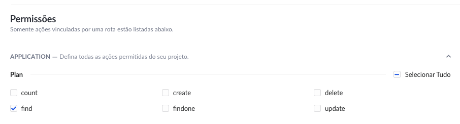

# strapi-plugin-route-permission

## 🚀 &nbsp; _Overview_

This plugin implements a simple way to seed strapi permission::users-permissions table from routes configuration. It means that you can define your routes permissions direcly on yours `routes.json` files. So every time your server ups, it will recreate yours routes permissions from routes.json file, allowing you to migrate your application without worrying about redefine your routes permissions over strapi panel.

---

## ⏳ &nbsp; _Installation_

With npm:
```bash
npm install strapi-plugin-route-permission
```

With yarn:
```bash
yarn add strapi-plugin-route-permission
```

---
## ✨ &nbsp; _Getting Started_

In many cases, you will lost your database data while your application is in development, but strapi has a tiny problem, for each route you want to get private or public permission, you need to configure it over strapi panel, and if you reset your database for any reason, every configuration is lost, and after some time, you can forgot waht route needs to be public or private, broking your logic application and taking your time to reconfigure everything agin.

Because this little detail, this plugin implements a simple route config rule, the `permission`, that can receive one of the default strapi permissions (`public` or `authenticated`) or any other permission that you have been created. With that, every time yours server startup, it read all your routes and recreate the permissions on database, keeping your application always updated.

### Example:
_See the property on `routes.*.config.permission` parameter._
```json
{
  "routes": [
    {
      "method": "GET",
      "path": "/plans",
      "handler": "plan.find",
      "config": {
        "permission": "authenticated",
        "policies": []
      }
    }
  ]
}
```

### Result:
_On strapi startup it reconfigure your permission table_



_On strapi permission panel, you can see the result applyed for the specified route._



---

## 🎉 &nbsp;  _Congradulations, You're done._

I hope this plugin helps you in your strapi projects and save a lot of time and code.

---
## 📜 &nbsp; _License_

This project is under the MIT license. See the [LICENSE](./LICENSE) for details.

--- 

💻 &nbsp; Developed by André Ciornavei - [Get in touch!](https://www.linkedin.com/in/andreciornavei/)